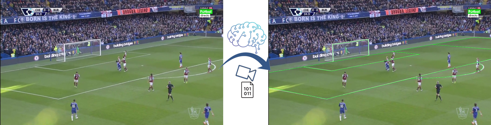

## SoccerNet Camera Callibration 2023



<div align="center">
 
[](https://arxiv.org/abs/2410.07401)
[](https://doi.org/10.1145/3689061.3689074)

</div>

The repository contains the 1st place solution for SoccerNet Camera Calibration 2023, which was a part of CVPR 2023.

The solution was developed by Sportlight Technology team: [Nikolay Falaleev](https://github.com/NikolasEnt) and [Ruilong Chen](https://github.com/ruilongml).

Technical details of the approach are available in [Top-1 solution of SoccerNet Camera Calibration Challenge 2023](https://nikolasent.github.io/deeplearning/computervision/2023/06/20/SoccerNet-Camera-Calibration-2023.html). A brief video presentation of the solution is available on [YouTube](https://www.youtube.com/watch?v=bP72jfyecrw). The details on the challenge are available on the SoccerNet task [page](https://www.soccer-net.org/tasks/camera-calibration).

Keypoints of the solution:

* The raw pitch annotation is processed by geometry algorithms, resulting in more accurate and comprehensive annotations that include additional keypoints such as tangent points for ellipses (57 points in total).
* The perception system consists of two models: keypoints and lines detection.
* Heuristic rules are applied to the predictions to derive the most plausible camera calibration parameters.

## Prerequirements

* Linux-powered computer with an Nvidia GPU. The code was tested on OpenSUSE 15.5 and Ubuntu 22.04.
* Nvidia GPU with at least 24GB of memory. Nvidia RTX 3090 and RTX 4090 GPUs were used during the challenge. Nvidia Driver version >= 535.
* [Docker](https://docs.docker.com/engine/install/) and [NVIDIA Container Toolkit](https://docs.nvidia.com/datacenter/cloud-native/container-toolkit/latest/install-guide.html).


## Quick start guide

The environment is provided as a Docker image; build it with `make build`. To start the container, use the command `make run`. All the following commands, describing how to train models or make predictions, should be executed within the docker container.


## Project structure

* `src` - The project's source directory.
* `notebooks` - Jupyter notebooks. It contains a notebook with the annotatio exploration and a notebook with ellipses geometry-related algorithms visualization.
* `data` - The project's storage for required files.
  * `data/experiments/` - Folder with individual experiments results and artifacts (each experiment has its individual folder in this location).
  * `data/dataset/` - Folder with `challenge`, `test`, `train` and `valid` data from the challenge organizers. Use the official [development kit](https://github.com/SoccerNet/sn-calibration) to get the datasets.
* `baseline` - The code of the baseline, adopted from the official [development kit](https://github.com/SoccerNet/sn-calibration). It is used for data handling and evaluation metrics.

## Keypoints model

The HRNet based model code is in [src/models/hrnet/](src/models/hrnet). The model training is configured by Hydra config file [src/models/hrnet/train_config.yaml](src/models/hrnet/train_config.yaml). Run `python src/models/hrnet/train.py` to train the model in the docker container environment.

Details on the model architecture are in the model [README.md](/src/models/hrnet/README.md).

### Optimize prediction model hyperparameters

In order to run the hyperparameter search with Optuna:
1. Specify the trained model path in [src/models/hrnet/val_config.yaml](src/models/hrnet/val_config.yaml). Make sure the rest of parameters for `model` and `data_params` section are the same to the values used during the model training.
2. Set initial guess and default values for the camera calibration heuristical algorithm in [src/models/hrnet/val_config.yaml](src/models/hrnet/val_config.yaml) `camera` section. Specify parameters seach space in [src/models/hrnet/optimize_valid.yaml](src/models/hrnet/optimize_valid.yaml) in `hydra.sweeper.params` (see Hydra [docs](https://hydra.cc/docs/plugins/optuna_sweeper/) for details on the sweeper configuratiuon). The provided parameters in the files represent the actual final used values during the course of experiments for the Challenge.
3. Run optimization: `cd src/models/hrnet/` and `python validate.py --config-name optimize_valid --multirun`.


## Line model

The Line detection based model code is in [src/models/line/](src/models/line). 
The model training is configured by Hydra config file 
[src/models/line/train_config.yaml](src/models/hrnet/train_config.yaml). 
Run `python src/models/line/train.py` to train the model in the docker container environment.

Details on the model architecture are in the model [README.md](/src/models/line/README.md).


Once the model is trained, prediction file should be prepared as described in [README.md, section Assemble line model result](/src/models/line/README.md#assemble-line-model-result).

## Final predictions and submit file creation

The final step is the submit file preparation. It can be created by a provided script: `python src/utils/make_submit.py`.
Update paths to actual model files in the accordingly. The file contains heuristics params used in the actual winning submission.

In fact, actual calibration algorithms and relevant heuristics are implemented in [src/models/hrnet/prediction.py](src/models/hrnet/prediction.py). The proposed code can indeed be adapted for use in other applications, related to camera calibration.

## Code navigation

Some key code files, which could be interesting to explore to grasp the fundamental concepts behind the solution, as well as the interesting aspects that may be adapted for other applications or techniques:

* Pitch model is defined in [/src/datatools/ellipse.py](/src/datatools/ellipse.py), PITCH_POINTS dictionary.
* Geometry algorithms:

  * Ellipse tangent points and ellipse-line intersection points: [/src/datatools/ellipse.py](/src/datatools/ellipse.py)
  * Lines intersections: [/src/datatools/intersections.py](/src/datatools/intersections.py)

* Models:

  * HRNet backbone: [/src/models/hrnet/hrnet.py](/src/models/hrnet/hrnet.py)
  * Keypoints model: [/src/models/hrnet/model.py](/src/models/hrnet/model.py), loss function and efficient Pytorch-based 2D Gaussian heatmaps generation: [/src/models/hrnet/loss.py](/src/models/hrnet/loss.py)
  * Lines model: [/src/models/line/model.py](/src/models/line/model.py)

* Camera calibration algorithms: [src/models/hrnet/prediction.py](src/models/hrnet/prediction.py)

## Cite
If you use this work in your research, please cite our paper by using the following BibTeX entry:

```latex
@inproceedings{10.1145/3689061.3689074,
author = {Falaleev, Nikolay S. and Chen, Ruilong},
title = {Enhancing Soccer Camera Calibration Through Keypoint Exploitation},
year = {2024},
isbn = {9798400711985},
publisher = {Association for Computing Machinery},
address = {New York, NY, USA},
doi = {10.1145/3689061.3689074},
booktitle = {Proceedings of the 7th ACM International Workshop on Multimedia Content Analysis in Sports},
pages = {65–73},
series = {MMSports '24}
}
```

## Useful links

* [https://github.com/SoccerNet/sn-calibration](https://github.com/SoccerNet/sn-calibration) Challenge discription and the baseline.
* [https://www.soccer-net.org/tasks/camera-calibration](https://www.soccer-net.org/tasks/camera-calibration) Challenge homepage.
* [https://arxiv.org/abs/2309.06006](https://arxiv.org/abs/2309.06006) Soccernet 2023 results report.
* [Evaluation server](https://eval.ai/web/challenges/challenge-page/1946/overview).
